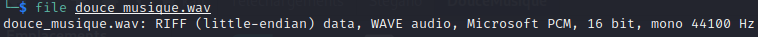
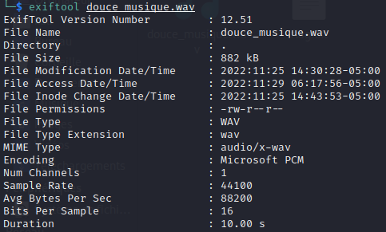

Le fichier à télécharger s'appelle "douce_musique.wav".

Premier réflexe, on s'assure du type de fichier dont il s'agit avec la commande ``file <nomDuFichier>`` :

Deuxième réflexe, on regarde les métadatas du fichier pour obtenir un maximum d'informations sur celui-ci avec la commande ``exiftool <nomDuFichier>`` :

Qui dit fichier audio, dit souvent l'utilisation d'un outil comme sonic-visualiser pour nous permettre d'analyser le fichier :

Pour installer sonic-visualiser sur kali linux : ``apt-get install sonic-visualiser``

Ici, en affichant le spectrogramme du fichier nous obtenons le flag :
