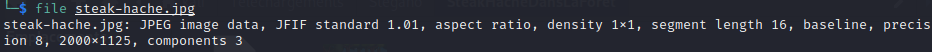
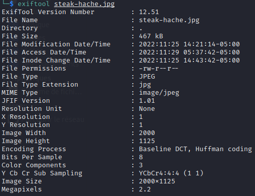
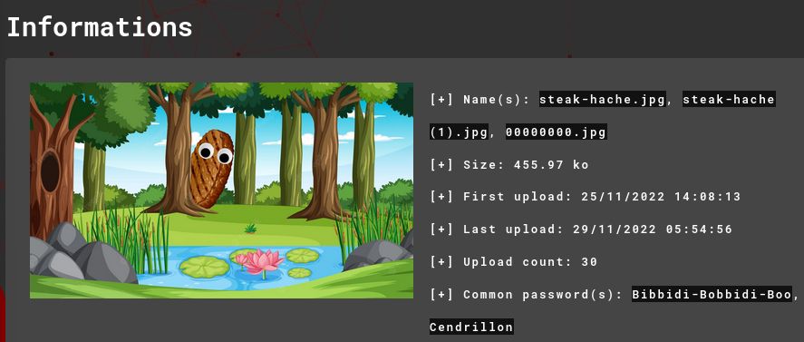
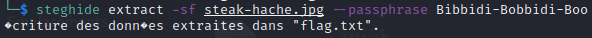
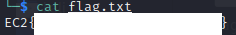

Le fichier à télécharger s'appelle "steak-hache.jpg".

Premier réflexe, on s'assure du type de fichier dont il s'agit avec la commande ``file <nomDuFichier>`` :

Deuxième réflexe, on regarde les métadatas du fichier pour obtenir un maximum d'informations sur celui-ci avec la commande ``exiftool <nomDuFichier>`` :

Il est possible d'obtenir encore plus d'informations en utilisant des solutions comme Aperi'Solve ou forensically :
	Aperi'Solve nous apprend notamment que le fichier possède des mots de passe :
	
	Et là bingo ! L'un des mots de passe proposés correspond à l'indice donné dans l'énoncé "sa phrase préférée est Bibbidi-Bobbidi-Boo". On en conclu qu'il s'agit du mot de passe à utiliser.

Qui dit mot de passe, dit utilisation de steghide pour pouvoir extraire les fichiers cachés grâce à ce mot de passe :

Un fichier "flag.txt" a été créé. Il nous suffit de lire son contenu pour obtenir le flag :
